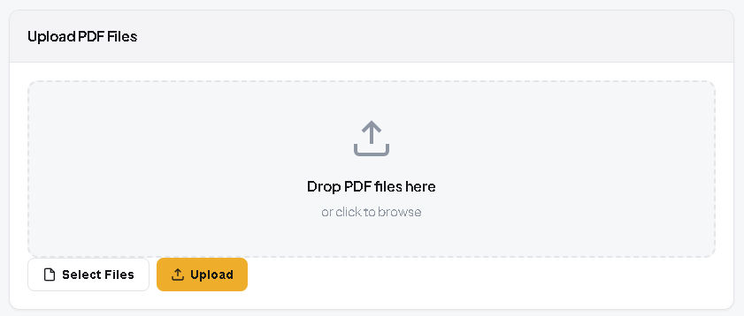
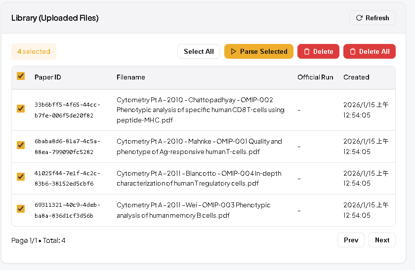
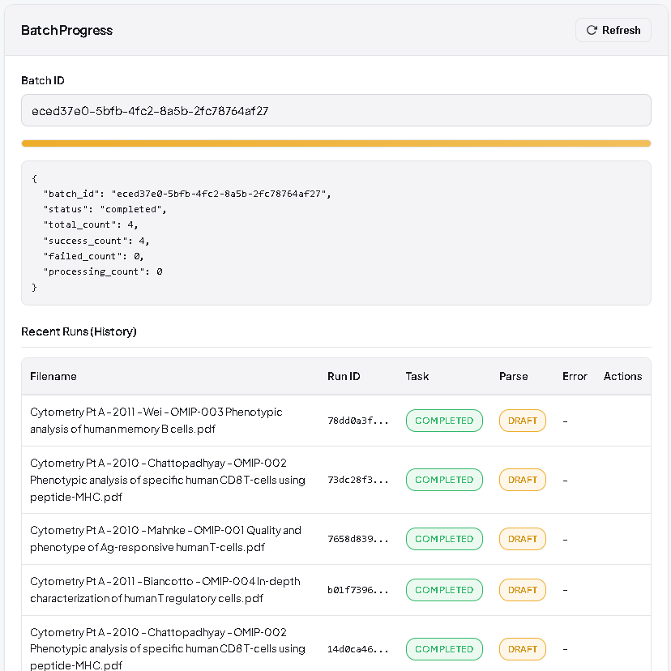
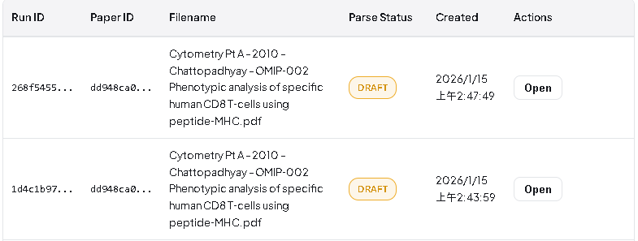

# OMIP PDF Batch Parsing & Human-in-the-Loop Review System

## 快速啟動

```bash
docker compose up
```

啟動後可前往前端 http://localhost:8088 測試頁面

## 選擇檔案並上傳


## 勾選並開始解析


## 查看進度狀態


## 支持進度追蹤、錯誤重試等機制


## 解析結果範例


## 編輯與歷史版本選擇


## 通過審核終版可下載


## 同一份文件可以重複解析彼此之間獨立


---

## 目錄

1. [技術選型與理由](#1-技術選型與理由)
2. [系統架構](#2-系統架構)
3. [資料模型設計](#3-資料模型設計)
4. [Batch / Parsing 流程](#4-batch--parsing-流程)
5. [權限與狀態說明](#5-權限與狀態說明)
6. [API 說明](#6-api-說明)
7. [設計決策與 Trade-offs](#7-設計決策與-trade-offs)
8. [需求對應檢查表](#8-需求對應檢查表)

---

## 1. 技術選型與理由

本專案的核心挑戰是：**批次處理 88 份 PDF、容忍解析錯誤、透過 Human-in-the-Loop 將不可信資料轉為可信資料**。技術選型需直接回應這些需求。

### 需求驅動的技術選型

| 核心需求 | 技術選擇 | 選擇理由 |
|----------|----------|----------|
| **「任一 PDF 失敗不得影響其他」** | Celery + Redis | 每個 PDF 獨立 task，失敗隔離；內建重試機制處理暫時性錯誤 |
| **「不可假設 parsing 即時完成」** | Celery Worker | 長時間 PDF 解析（可達數分鐘）移至背景執行，API 立即回應 |
| **「狀態可追蹤、可回溯」** | PostgreSQL | ACID 保證狀態轉移原子性；FK 約束確保 Batch→Run→Paper 關聯完整 |
| **「approve 是狀態轉移」** | PostgreSQL + Enum | 資料庫層級強制狀態機，防止非法狀態轉移 |
| **「batch 是 first-class entity」** | PostgreSQL | Batch 表獨立存在，有自己的生命週期與狀態，非僅 metadata 標籤 |
| **「資料模型容許錯誤存在」** | PostgreSQL JSONB | 結構化儲存錯誤訊息、原始解析結果；彈性 schema 容納 table/figure 變異 |
| **「Parsing 與 API 不得同一層」** | Celery 獨立 Worker | Worker 與 API Server 分離部署，解耦 parsing 邏輯 |
| **「Parsing 必須可重跑」** | MinIO + SHA-256 | PDF 原檔持久儲存；hash 去重避免重複上傳 |

### 技術棧總覽

| 技術 | 用途 | 對應需求 |
|------|------|----------|
| **FastAPI** | API Layer | 原生 async、自動 OpenAPI 文件便於 Reviewer 驗證 |
| **PostgreSQL 15** | 主資料庫 | 狀態管理、多表關聯、ACID 保證 |
| **Redis** | Message Broker | Celery task 佇列、任務狀態追蹤 |
| **Celery** | 異步任務處理 | 背景 parsing、失敗重試、進度追蹤 |
| **MinIO** | PDF 物件儲存 | 原檔持久化、支援重新解析 |
| **SQLAlchemy 2.0** | ORM | 型別安全、Repository 模式封裝 |

---

### 關鍵技術決策

#### 為什麼選 PostgreSQL 而非 MongoDB？

**需求對照**：系統需要「狀態可追蹤」、「approve 是狀態轉移」、「batch 是 first-class entity」

| 需求 | PostgreSQL 如何滿足 | MongoDB 的問題 |
|------|---------------------|----------------|
| **狀態轉移原子性** | 單一 transaction 內完成 `status=approved` + `official_run_id` 設定 | 跨 collection 更新需 2PC 或應用層補償 |
| **Batch 進度追蹤** | `UPDATE batches SET success_count = success_count + 1` 原子操作 | 需 `$inc` 或應用層計算，race condition 風險 |
| **資料完整性** | FK 約束：刪除 Batch 時阻止，若仍有關聯 ParseRun | 無 FK，需應用層維護孤兒記錄 |
| **狀態機強制** | CHECK 約束：`status IN ('draft','approved','rejected')` | Schema validation 較弱 |

**結論**：Human-in-the-Loop 的核心是**嚴格的狀態管理**。PostgreSQL 的 ACID 與約束機制從資料庫層保證狀態一致性，而非依賴應用層檢查。

#### 為什麼選 Celery + Redis 而非 FastAPI BackgroundTasks？

**需求對照**：「任一 PDF 失敗不得影響其他」、「不可假設 parsing 即時完成」、「必須可追蹤進度」

| 需求 | Celery + Redis | BackgroundTasks |
|------|----------------|-----------------|
| **失敗隔離** | 每個 PDF 獨立 task，異常不傳播 | 同 process，一個失敗可能影響其他 |
| **任務持久化** | task 存於 Redis，API 重啟不丟失 | 記憶體中，重啟即丟失 |
| **重試機制** | 內建 `max_retries`、`exponential backoff` | 需自行實作 |
| **進度追蹤** | `batch.success_count` 由 worker callback 更新 | 需自建追蹤機制 |
| **水平擴展** | 多 worker 並行處理 88 份 PDF | 單一 process |

**結論**：88 份 PDF 批次處理需要**生產級的任務佇列**。Celery 提供的失敗隔離與重試機制直接滿足「單一失敗不影響 batch」的硬性要求。

#### 為什麼選 MinIO 而非本地檔案系統？

**需求對照**：「Parsing 必須可重跑」、「Parsing 結果必須可回溯」

| 需求 | MinIO | 本地檔案系統 |
|------|-------|--------------|
| **重新解析** | 原檔永久保存，任意時間可重跑 parsing | 需管理檔案生命週期 |
| **多 Worker 存取** | S3 API 無狀態存取，worker 水平擴展 | 需 NFS 或共享卷 |
| **去重** | object key = SHA-256 hash，自動去重 | 需額外建立 hash 索引 |
| **生產遷移** | API 相容 AWS S3，零修改遷移 | 需重寫存取層 |

**結論**：支援重新解析的前提是**原檔可靠儲存**。MinIO 的 S3 相容 API 讓系統具備生產環境遷移能力。

---

## 2. 系統架構

### 整體架構圖

```
┌─────────────────────────────────────────────────────────────────┐
│                         Client (API Consumer)                    │
└─────────────────────────────────┬───────────────────────────────┘
                                  │ HTTP
                                  ▼
┌─────────────────────────────────────────────────────────────────┐
│                         FastAPI (API Layer)                      │
│  ┌──────────┐ ┌──────────┐ ┌──────────┐ ┌──────────┐           │
│  │ Batches  │ │ Papers   │ │ Elements │ │ Reviews  │           │
│  │ Router   │ │ Router   │ │ Router   │ │ Router   │           │
│  └────┬─────┘ └────┬─────┘ └────┬─────┘ └────┬─────┘           │
│       └────────────┴────────────┴────────────┘                  │
│                         │                                        │
│  ┌──────────────────────┴───────────────────────────────────┐   │
│  │                    Service Layer                          │   │
│  │  ParseService │ ReviewService │ ElementService            │   │
│  └──────────────────────┬───────────────────────────────────┘   │
│                         │                                        │
│  ┌──────────────────────┴───────────────────────────────────┐   │
│  │                  Repository Layer                         │   │
│  │  BatchRepo │ PaperRepo │ RunRepo │ ElementRepo            │   │
│  └──────────────────────────────────────────────────────────┘   │
└─────────────────────────────────┬───────────────────────────────┘
                                  │
         ┌────────────────────────┼────────────────────────┐
         │                        │                        │
         ▼                        ▼                        ▼
┌─────────────────┐    ┌─────────────────┐    ┌─────────────────┐
│   PostgreSQL    │    │     Redis       │    │     MinIO       │
│  (主資料庫)      │    │  (Broker/Cache) │    │  (PDF 儲存)     │
└─────────────────┘    └────────┬────────┘    └────────┬────────┘
                                │                      │
                                ▼                      │
                       ┌─────────────────┐             │
                       │  Celery Worker  │◄────────────┘
                       │  (異步解析)      │
                       └─────────────────┘
```

### 分層設計原則

```
Router (HTTP 路由) → Controller (請求處理) → Service (業務邏輯) → Repository (資料存取)
```

- **Router**: 定義 HTTP 端點、參數驗證、權限檢查
- **Service**: 封裝業務邏輯、協調多個 Repository
- **Repository**: 純粹的資料存取操作、SQL 封裝

**為什麼這樣分層？** Parsing 邏輯與 API 完全解耦，可獨立測試、獨立部署。

---

## 3. 資料模型設計

### Entity Relationship Diagram

```
┌─────────────┐     1:N     ┌─────────────┐     N:1     ┌─────────────┐
│   Batch     │────────────▶│  ParseRun   │◀────────────│   Paper     │
│             │             │             │             │             │
│ id          │             │ id          │             │ id          │
│ status      │             │ paper_id    │             │ file_hash   │
│ total_count │             │ batch_id    │             │ filename    │
│ success_cnt │             │ status      │             │ official_   │
│ failed_cnt  │             │ task_state  │             │   run_id ◀──┼──┐
│ created_at  │             │ raw_metadata│             │ created_at  │  │
│ updated_at  │             │ error_msg   │             └─────────────┘  │
└─────────────┘             │ created_at  │                              │
                            │ updated_at  │                              │
                            └──────┬──────┘                              │
                                   │                                     │
                    ┌──────────────┼──────────────┐                      │
                    │ 1:N          │ 1:N          │                      │
                    ▼              ▼              │                      │
           ┌───────────────┐ ┌───────────────┐   │                      │
           │ParsedMetadata │ │ExtractedElement│   │ approve 時設定 ──────┘
           │               │ │               │   │
           │ id            │ │ id            │
           │ run_id        │ │ run_id        │
           │ omip_id       │ │ type (table/  │
           │ title         │ │       figure) │
           │ authors       │ │ label         │
           │ year          │ │ caption       │
           │ created_at    │ │ content (JSON)│
           └───────────────┘ │ order_index   │
              (版本歷史)      └───────────────┘
```

### 核心設計理念

#### Batch 作為 First-Class Entity

```sql
CREATE TABLE batches (
    id UUID PRIMARY KEY,
    status batch_status NOT NULL DEFAULT 'pending',
    total_count INTEGER NOT NULL DEFAULT 0,
    success_count INTEGER NOT NULL DEFAULT 0,
    failed_count INTEGER NOT NULL DEFAULT 0,
    created_at TIMESTAMPTZ DEFAULT NOW(),
    updated_at TIMESTAMPTZ DEFAULT NOW()
);
```

**Batch 不只是 ParseRun 的 grouping，而是：**
- 擁有獨立的生命週期和狀態
- 可追蹤整體進度（total/success/failed）
- 支援批次重試操作

#### Paper 與 ParseRun 分離

**Paper**: 代表一份 PDF 檔案的身份
- `file_hash`: SHA-256 確保唯一性，支援去重
- `official_run_id`: 指向已核可的 ParseRun

**ParseRun**: 代表一次解析嘗試
- 同一 Paper 可有多次 ParseRun
- 每次 re-parse 產生新 ParseRun，舊的不被覆蓋

```
Paper (身份) ──1:N──▶ ParseRun (解析嘗試)
              │
              └──────▶ official_run_id (指向唯一核可版本)
```

#### 錯誤容許設計

**ParseRun 的雙狀態設計：**

```python
class ParseStatus(Enum):
    draft = "draft"       # 解析完成，待審核
    approved = "approved" # 已核可
    rejected = "rejected" # 已拒絕
    failed = "failed"     # 解析失敗

class BatchStatus(Enum):
    pending = "pending"       # 等待處理
    processing = "processing" # 處理中
    completed = "completed"   # 全部完成
    failed = "failed"         # 有失敗項目
```

| 欄位 | 用途 | 可能值 |
|------|------|--------|
| `status` | 審核狀態 | draft → approved/rejected |
| `task_state` | 任務執行狀態 | pending → processing → completed/failed |

**為什麼分開？**
- 解析成功但內容有誤 → `task_state=completed, status=draft`
- 解析失敗 → `task_state=failed, status=failed`
- 可獨立追蹤「技術成功」與「業務核可」

#### 版本歷史追蹤

`ParsedMetadata` 表儲存所有修改歷史：

```sql
CREATE TABLE parsed_metadata (
    id UUID PRIMARY KEY,
    run_id UUID REFERENCES parse_runs(id),
    omip_id VARCHAR(50),
    title TEXT,
    authors JSONB,
    year INTEGER,
    created_at TIMESTAMPTZ DEFAULT NOW()
);
```

每次 annotator 修改 metadata，建立新記錄而非更新，實現：
- 完整修改歷史
- 可回溯任一版本
- 審計追蹤

---

## 4. Batch / Parsing 流程

### 完整流程圖

```
                                    ┌─────────────────┐
                                    │  POST /batches  │
                                    │    /parse       │
                                    └────────┬────────┘
                                             │
                         ┌───────────────────▼───────────────────┐
                         │         1. 讀取上傳檔案                 │
                         │         2. 計算 SHA-256 hash           │
                         │         3. 上傳至 MinIO                │
                         └───────────────────┬───────────────────┘
                                             │
                         ┌───────────────────▼───────────────────┐
                         │         4. 建立 Batch (status=processing)│
                         │         5. 建立/查找 Paper (by hash)    │
                         │         6. 建立 ParseRun (status=draft) │
                         └───────────────────┬───────────────────┘
                                             │
                         ┌───────────────────▼───────────────────┐
                         │         7. 派發 Celery Task            │
                         │            (每個 PDF 一個 task)         │
                         └───────────────────┬───────────────────┘
                                             │
                              ◄── HTTP 立即返回 batch_id ──►
                                             │
┌────────────────────────────────────────────┼────────────────────────────────────────────┐
│                                 Celery Worker (異步)                                    │
│                                            │                                            │
│            ┌───────────────────────────────▼───────────────────────────────┐           │
│            │                    parse_pdf_task                              │           │
│            │                                                                │           │
│            │  8. task_state = processing                                    │           │
│            │  9. 從 MinIO 下載 PDF                                          │           │
│            │  10. 呼叫 PARSER API 解析                                      │           │
│            │  11. 儲存 metadata + elements                                  │           │
│            │  12. task_state = completed                                    │           │
│            │  13. 更新 batch.success_count                                  │           │
│            └───────────────────────────────┬───────────────────────────────┘           │
│                                            │                                            │
│                           ┌────────────────┴────────────────┐                          │
│                           │ 失敗處理                         │                          │
│                           │                                  │                          │
│                           │ - 可重試錯誤: retry 最多 3 次     │                          │
│                           │ - 不可重試: status=failed        │                          │
│                           │ - 更新 batch.failed_count        │                          │
│                           └─────────────────────────────────┘                          │
└────────────────────────────────────────────────────────────────────────────────────────┘
                                             │
                         ┌───────────────────▼───────────────────┐
                         │  所有 task 完成後                       │
                         │  batch.status = completed/failed       │
                         └───────────────────────────────────────┘
```

### 單一 PDF 失敗不影響整體

```python
# tasks.py 中的錯誤處理
@celery_app.task(bind=True, max_retries=3, ...)
def parse_pdf_task(self, batch_id, run_id, filename, object_key):
    try:
        # 解析邏輯...
        batch_repo.increment_success(batch_id)
    except RetryableError as e:
        # 可重試: 503, timeout 等
        raise self.retry(exc=e, countdown=60)
    except Exception as e:
        # 不可重試: 標記失敗，繼續處理其他
        run_repo.mark_failed(run_id, str(e))
        batch_repo.increment_failed(batch_id)
        # 不 raise，讓其他 task 繼續
```

### 進度追蹤

```http
GET /api/batches/{batch_id}

Response:
{
    "id": "uuid",
    "status": "processing",
    "total_count": 88,
    "success_count": 45,
    "failed_count": 2,
    "processing_count": 41  // 計算: total - success - failed
}
```

---

## 5. 權限與狀態說明

### 角色權限矩陣

| 操作 | Viewer | Annotator | Reviewer |
|------|--------|-----------|----------|
| 查看已核可資料 | ✅ | ✅ | ✅ |
| 查看 draft 資料 | ❌ | ✅ | ✅ |
| 上傳 PDF | ❌ | ✅ | ✅ |
| 修改 parsing 結果 | ❌ | ✅ | ❌ |
| Approve / Reject | ❌ | ❌ | ✅ |
| 查看 batch 進度 | ❌ | ✅ | ✅ |

### 實作方式

```python
# deps.py
async def require_role(*allowed_roles: str):
    def dependency(role: str = Header(alias="X-Role")):
        if role not in allowed_roles:
            raise HTTPException(403, "Forbidden")
        return role
    return Depends(dependency)

# 使用
@router.post("/reviews/{run_id}/approve")
async def approve(run_id: UUID, role: str = Depends(require_role("reviewer"))):
    ...
```

### Approval 狀態轉移

```
                     ┌──────────────────────────────────────┐
                     │                                      │
                     ▼                                      │
┌─────────┐      ┌─────────┐      ┌───────────┐           │
│ pending │ ───▶ │  draft  │ ───▶ │ approved  │           │
│(task)   │      │         │      │           │           │
└─────────┘      └────┬────┘      └─────┬─────┘           │
                      │                  │                 │
                      │                  │  官方版本設定     │
                      ▼                  │                 │
                 ┌─────────┐             │                 │
                 │rejected │             ▼                 │
                 │         │      paper.official_run_id    │
                 └─────────┘             │                 │
                                         │                 │
                                   viewer 可見 ◄───────────┘
```

**Approve 是狀態轉移，不是單純的 flag：**

```python
# review_service.py
def approve(run_id: UUID):
    run = run_repo.get(run_id)

    # 1. 狀態驗證
    if run.status != ParseStatus.draft:
        raise InvalidStateError("Only draft can be approved")

    # 2. 狀態轉移
    run.status = ParseStatus.approved
    run.reviewed_at = datetime.utcnow()

    # 3. 設定官方版本
    paper_repo.set_official_run(run.paper_id, run_id)

    # 4. 解除舊官方版本（如有）
    # ...
```

### 資料不可變性

核可後的資料不可修改：

```python
# element_service.py
def update_table(element_id: UUID, updates: dict):
    element = element_repo.get(element_id)
    run = run_repo.get(element.run_id)

    if run.status != ParseStatus.draft:
        raise ForbiddenError("Cannot modify approved/rejected data")

    # 執行更新...
```

---

## 6. API 說明

### Batch 相關

| Method | Endpoint | 角色 | 說明 |
|--------|----------|------|------|
| `POST` | `/api/batches/parse` | annotator | 上傳 PDF 並建立批次解析 |
| `GET` | `/api/batches` | annotator | 列出所有 batch |
| `GET` | `/api/batches/{batch_id}` | annotator | 查看 batch 進度 |
| `GET` | `/api/batches/{batch_id}/runs` | annotator | 列出 batch 內所有 run |

### Paper 相關

| Method | Endpoint | 角色 | 說明 |
|--------|----------|------|------|
| `GET` | `/api/papers` | viewer+ | 列出 papers |
| `GET` | `/api/papers/{paper_id}` | viewer+ | 取得已核可資料 |
| `GET` | `/api/papers/{paper_id}/draft` | annotator+ | 取得 draft 資料 |

### 編輯相關

| Method | Endpoint | 角色 | 說明 |
|--------|----------|------|------|
| `PATCH` | `/api/tables/{element_id}` | annotator | 修改 table |
| `PATCH` | `/api/figures/{element_id}` | annotator | 修改 figure |
| `PUT` | `/api/runs/{run_id}/metadata` | annotator | 修改 metadata |

### 審核相關

| Method | Endpoint | 角色 | 說明 |
|--------|----------|------|------|
| `POST` | `/api/reviews/{run_id}/approve` | reviewer | 核可 |
| `POST` | `/api/reviews/{run_id}/reject` | reviewer | 拒絕 |

### 重試相關

| Method | Endpoint | 角色 | 說明 |
|--------|----------|------|------|
| `POST` | `/api/runs/{run_id}/retry` | annotator | 重試單一 run |
| `POST` | `/api/runs/retry-failed` | annotator | 重試所有失敗 |

---

## 7. 設計決策與 Trade-offs

### 7.1 為什麼 Batch 是 First-Class Entity？

**替代方案**: 只用 tags 或 metadata 分組

| 面向 | First-Class Batch | Tag/Metadata 分組 |
|------|-------------------|-------------------|
| 進度追蹤 | 原生支援 success/failed count | 需每次 aggregate 計算 |
| 原子操作 | Batch 有獨立狀態機 | 無法整體重試 |
| 查詢效率 | 單一 JOIN | 複雜 GROUP BY |

**決定**: Batch 作為獨立實體，因為需求明確要求追蹤 88 份 PDF 的整體進度。

### 7.2 為什麼用雙狀態（status + task_state）？

**替代方案**: 單一 status 欄位

```
單一狀態: pending → processing → completed → approved
問題: 無法區分「解析成功待審」與「解析失敗」
```

**雙狀態優勢**:
- `task_state`: 技術層面的執行狀態
- `status`: 業務層面的審核狀態
- 可獨立查詢「解析失敗」與「審核未通過」

### 7.3 為什麼 metadata 要版本化？

**替代方案**: 直接更新 ParseRun.raw_metadata

| 面向 | 版本化 (ParsedMetadata) | 直接更新 |
|------|-------------------------|----------|
| 回溯能力 | 可查看任一歷史版本 | 只有最新版 |
| 審計 | 完整修改記錄 | 無 |
| 儲存成本 | 較高 | 較低 |

**決定**: 需求強調「可追蹤、可回溯」，儲存成本可接受。

### 7.4 為什麼選擇 Celery 而非 FastAPI BackgroundTasks？

| 面向 | Celery | BackgroundTasks |
|------|--------|-----------------|
| 持久化 | 任務保存在 Redis | 記憶體，重啟丟失 |
| 重試機制 | 內建 exponential backoff | 需自行實作 |
| 監控 | Flower 等工具 | 無 |
| 水平擴展 | 多 worker | 單一 process |

**決定**: PDF parsing 可能耗時數分鐘，需要持久化和重試機制。

### 7.5 錯誤處理策略

```python
# 可重試錯誤（暫時性）
RETRYABLE_ERRORS = {503, 502, 504, "timeout", "connection"}

# 不可重試錯誤（永久性）
# - PDF 格式損壞
# - OMIP ID 找不到
# - Parser 回傳 400
```

**策略**:
- 暫時性錯誤: 最多重試 3 次，exponential backoff
- 永久性錯誤: 立即標記失敗，記錄 error_msg

---

## 8. 需求對應檢查表

### User Stories 對應

| User Story | 實作 | 驗證方式 |
|------------|------|----------|
| US1: 單一 PDF 解析 | `POST /api/batches/parse` (單檔) | 建立 parse_run, status=draft |
| US2: 批次處理 88 份 | `POST /api/batches/parse` (多檔) | 獨立 paper/run，失敗不影響其他 |
| US3: 批次狀態追蹤 | `GET /api/batches/{id}` | 返回 total/success/failed/processing |
| US4: Annotator 修正 | `PATCH /api/tables/{id}`, `PUT /api/runs/{id}/metadata` | 只能改 draft |
| US5: Reviewer 核可 | `POST /api/reviews/{id}/approve` | status → approved, official_run_id 設定 |
| US6: Viewer 存取 | `GET /api/papers/{id}` | 只返回 approved 資料 |
| US7: 重新解析 | `POST /api/runs/{id}/retry` | 新 parse_run, 舊的保留 |

### 評分重點對應

| 評分項目 | 如何達成 |
|----------|----------|
| **資料模型容許錯誤** | ParseRun 有 failed 狀態，error_msg 記錄原因 |
| **狀態可追蹤、可回溯** | 雙狀態設計 + ParsedMetadata 版本歷史 |
| **approve 是狀態轉移** | status enum 轉移 + official_run_id 設定 |
| **batch 是 first-class entity** | 獨立 Batch 表，有自己的狀態和計數器 |
| **文件可讓他人接手** | 本文件涵蓋架構、API、資料模型、設計決策 |

### Functional Requirements 對應

| 需求 | 實作位置 |
|------|----------|
| PDF Parsing (omip_id, title, authors, year) | `ParsedMetadata` model |
| Tables (編號, caption, row/column) | `ExtractedElement.content` (JSONB) |
| Figures (編號, caption, image) | `ExtractedElement.content` (JSONB) |
| 多次 parsing | 同 Paper 可有多個 ParseRun |
| batch 與 parse_run 關聯 | `ParseRun.batch_id` FK |
| approval 狀態追蹤 | `ParseRun.status`, `reviewed_at` |
| immutable approved data | `ElementService` 檢查 status 後才允許修改 |

### Non-Functional Requirements 對應

| 需求 | 實作 |
|------|------|
| 不假設即時完成 | Celery 異步處理 |
| background/async/worker | Celery Worker 獨立 container |
| 單一失敗不影響 batch | 每個 PDF 獨立 task，錯誤不 propagate |
| 可追蹤進度 | Batch.success_count / failed_count |
| Parsing 與 API 分層 | Worker 獨立於 API server |
| Parsing 可重跑 | `POST /api/runs/{id}/retry` |
| Parsing 結果可回溯 | ParsedMetadata 版本歷史 |

---

## 附錄：目錄結構

```
/root/ahead-take-home/
├── app/
│   ├── main.py              # FastAPI 入口
│   ├── core/                # 設定、依賴注入
│   ├── models/              # SQLAlchemy ORM models
│   ├── schemas/             # Pydantic schemas
│   ├── repositories/        # 資料存取層
│   ├── services/            # 業務邏輯層
│   ├── routers/             # API 路由
│   └── workers/             # Celery tasks
├── db/init/                 # PostgreSQL 初始化 SQL
├── docker/                  # Dockerfile & entrypoints
├── tests/                   # 測試
├── docker-compose.yml       # 容器編排
└── requirements.txt         # Python 依賴
```
